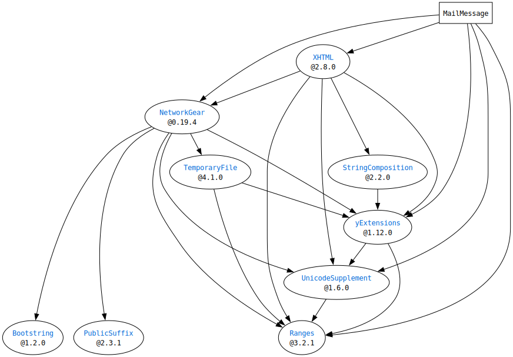

# What is `SwiftMailMessage`?

It will provide a representation of mail message.
It does *not* provide functions like a mailer.

# Requirements

- Swift 5
- macOS(>=10.15) or Linux

## Dependencies




# Usage

You can get a text or data representation for a mail message like below.
- The output can be used for `sendmail -i -t`'s standard input.
- You can also use [Gmail API's Message](https://developers.google.com/gmail/api/reference/rest/v1/users.messages#Message) after the output is encoded with Base64.

## Plain Text Message

```Swift
import MailMessage

let body = PlainText(
  text: """
    Hello, World!
    こんにちは、世界！
    """,
  stringEncoding: .iso2022JP,
  contentTransferEncoding: ._7bit
)
let message = MailMessage(
  author: Person(displayName: "Author", mailAddress: "author@example.com"),
  recipients: Group([Person(displayName: "Recipient", mailAddress: "recipient@example.com")]),
  subject: "My First Mail Message. - 私の初めてのメールメッセージ -",
  body: body
)

print(try message.deliverableDescription(using: .iso2022JP))
/*
== OUTPUT ==
From: Author <author@example.com>
To: Recipient <recipient@example.com>
Subject: My First Mail Message. - =?iso-2022-jp?B?GyRCO2QkTj1pJGEbKEI=?=
 =?iso-2022-jp?B?GyRCJEYkTiVhITwlayVhJUMlOyE8JTgbKEI=?= -
Content-Transfer-Encoding: 7bit
Content-Type: text/plain; charset=iso-2022-jp

Hello, World!
$B$3$s$K$A$O!"@$3&!*(B

*/

```


## Rich Text Message (XHTML)

```Swift
import MailMessage
import XHTML

let plainText = PlainText(
  text: "Hello, HTML!",
  contentTransferEncoding: .quotedPrintable
)
let xhtml = XHTMLDocument.template(
  title: "XHTML Title",
  contents: [
    .div(children: [.text("XHTML")])
  ]
)
let htmlContent = RichText.HTMLContent(xhtml: xhtml)
let richText = RichText(plainText: plainText, htmlContent: htmlContent)

let message = MailMessage(
  recipients: Group([Person(mailAddress: "recipient@example.com")]),
  subject: "Rich Text Mail",
  body: richText
)

print(try message.deliverableDescription())

/*
== OUTPUT ==
To: recipient@example.com
Subject: Rich Text Mail
Content-Type: multipart/alternative;
 boundary="6v1YAWqdQCUybGGiWXME4RXQ--git.io/JOYPU"
Content-Transfer-Encoding: quoted-printable

--6v1YAWqdQCUybGGiWXME4RXQ--git.io/JOYPU
Content-Type: text/plain; charset=utf-8
Content-Transfer-Encoding: quoted-printable

Hello, HTML!
--6v1YAWqdQCUybGGiWXME4RXQ--git.io/JOYPU
Content-Type: text/html; charset=utf-8
Content-Transfer-Encoding: quoted-printable

<?xml version=3D"1.0" encoding=3D"utf-8"?>
<!DOCTYPE html>
<html xmlns=3D"http://www.w3.org/1999/xhtml"><head><title>XHTML Title</titl=
e></head><body><div>XHTML</div></body></html>
--6v1YAWqdQCUybGGiWXME4RXQ--git.io/JOYPU--
*/

```


## Attach Files

```Swift
import MailMessage
import XHTML

let plainText = PlainText(
  text: "Hello, many resources!",
  stringEncoding: .ascii,
  contentTransferEncoding: .quotedPrintable
)
let pngFile = File(
  filename: "samll.png",
  contentType: MIMEType(pathExtension: .png)!,
  contentID: ContentID(rawValue: "<some-content-id@swift.mail.message>")!,
  content: InputStream(url: pngFileURL)!
)
let xhtml = XHTMLDocument.template(
  title: "title",
  contents: [
    .text("Hello, image!"),
    .image(attributes: ["src": "cid:some-content-id@swift.mail.message"]),
  ]
)
let htmlContent = RichText.HTMLContent(xhtml: xhtml, resources: [pngFile])
let richText = RichText(plainText: plainText, htmlContent: htmlContent)
let body = FileAttachedBody(mainBody: richText, files: [shortTextFile])
let message = MailMessage(
  recipients: Group([Person(mailAddress: "recipient@example.com")]),
  subject: "Full Message",
  body: body
)

print(try message.deliverableDescription())

// OUTPUT omitted

```


# License

MIT License.  
See "LICENSE.txt" for more information.
